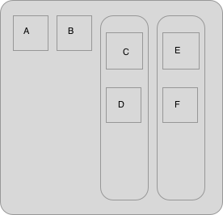

```{r}
library(tidyverse)
```

# 20.3 Important types of atomic vector

## 20.3.5 Exercises

1. Describe the difference between `is.finite(x)` and `!is.infinite(x)`.

```{r}
?is.finite
```

**`is.finite` will return a `FALSE` element for not only `Inf` and `-Inf` but also for `NA` and `NaN` as they aren't finite values. On the other hand, `is.infinite` only returns `TRUE` for `Inf` and `-Inf`, so `!is.infinite` will return `FALSE` for those values but ends up returning `TRUE` for `NA` and `NaN`.**

```{r}
is.finite(c(0, Inf, -Inf, NA, NaN))
!is.infinite(c(0, Inf, -Inf, NA, NaN))
```

2. Read the source code for `dplyr::near()` (Hint: to see the source code, drop the `()`). How does it work?

```{r}
near
```

**It tests whether the absolute value of the difference between the two values is less than a tolerance threshold, which has a default value or can be overridden.**

3. A logical vector can take 3 possible values. How many possible values can an integer vector take? How many possible values can a double take? Use google to do some research.

```{r}
.Machine$integer.max
```

**This is `2 ^ 31 - 1` and is the maximum integer value R can handle. Negative values can go to the same absolute value. So the total number of possible values is above 4.2 billion, and then there are the special values such as `NA`.**

4. Brainstorm at least four functions that allow you to convert a double to an integer. How do they differ? Be precise.

**There is an `as.integer()` function that will coerce values to be integers. The rounding functions (`round`, `floor`, etc.) appear to return doubles even though the value has been made a whole number.**

5. What functions from the readr package allow you to turn a string into logical, integer, and double vector?

```{r}
?parse_logical
```

**The `parse_` functions take a character vector and parse them to other vector types.**

# 20.4 Using atomic vectors

## 20.4.6 Exercises

1. What does `mean(is.na(x))` tell you about a vector `x`? What about `sum(!is.finite(x)`)?

**`mean(is.na(x))` tells you the proportion of elements in the vector that are missing values. `sum(!is.finite(x))` tells you how many of the elements in the vector aren't finite values.**

2. Carefully read the documentation of `is.vector()`. What does it actually test for? Why does `is.atomic()` not agree with the definition of atomic vectors above?

```{r}
?is.vector
?is.atomic
```

**`is.vector()` tests whether `x` is a vector of the specified mode (default is "any") that has no attributes other than names. `is.atomic()` returns `TRUE` not only if `x` is of an atomic type, but also for `NULL`.**

3. Compare and contrast `setNames()` with `purrr::set_names()`.

```{r}
?setNames
?purrr::set_names
```

**`set_names` adjusts the defaults so that if a vector is passed in without a second argument, the vector will be named with itself. As a tidyverse function it will also include checks to prevent silent recycling.**

4. Create functions that take a vector as input and returns:

  1. The last value. Should you use `[` or `[[`?
  2. The elements at even numbered positions.
  3. Every element except the last value.
  4. Only even numbers (and no missing values).

```{r}
get_last <- function(x) {
  x[[length(x)]] # use [[ because we want just the single value
}

get_even_pos <- function(x) {
  x[c(FALSE, TRUE)] # The two elements will be recycled to the full length of x
}

drop_last <- function(x) {
  x[-length(x)]
}

get_even_val <- function(x) {
  x[!is.na(x) & x %% 2 == 0]
}

test <- c(NA, 0:5, NA, 6:10)
get_last(test)
get_even_pos(test)
drop_last(test)
get_even_val(test)
```

5. Why is `x[-which(x > 0)]` not the same as `x[x <= 0]`?

```{r}
test2 <- c(-10, 8, NA, 0)
test2[-which(test2 > 0)]
test2[test2 <= 0]
```

**I'll leave this for now.**

6. What happens when you subset with a positive integer that’s bigger than the length of the vector? What happens when you subset with a name that doesn’t exist?

```{r}
test3 <- c(a = 1, b = 2, c = 3)
test3[2:4]
test3[c("c", "d")]
```

**Subsetting with too large a number returns `NA` for any elements that are beyond the length of the original vector. Using a name that doesn't exist will also return an `NA`.**

# 20.5 Recursive vectors (lists)

## 20.5.4 Exercises

1. Draw the following lists as nested sets:

  1. list(a, b, list(c, d), list(e, f))
  
  
  
  2. list(list(list(list(list(list(a))))))
  
  **I'm not spending time on this one at this stage.**

2. What happens if you subset a tibble as if you’re subsetting a list? What are the key differences between a list and a tibble?

```{r}
tib <- tibble(
  x = c("a", "b", "c"),
  y = c("d", "e", "f"),
  z = c(1:3)
)
tib["x"]
tib[1]
tib[c("x", "y")]
tib[["x"]]
str(tib["x"])
str(tib[["x"]])
```

**The general operations appear to be pretty much the same - just as single `[]` subsetting of a list produces a list, doing it with a tibble returns another tibble. `[[]]` returns a vector.**

# 20.7 Augmented vectors

## 20.7.4 Exercises

1. What does `hms::hms(3600)` return? How does it print? What primitive type is the augmented vector built on top of? What attributes does it use?

```{r}
aug1 <- hms::hms(3600)
aug1
typeof(aug1)
attributes(aug1)
```

**It prints as a time in hours, minutes and seconds (separated by colons). The primitive type is a double (floating point number). Its attributes are units (value is in seconds) and class (hms and difftime).**

2. Try and make a tibble that has columns with different lengths. What happens?

```{r}
aug2 <- tibble(
  x <- c("a", "b", "c"),
  y <- c(1:5)
)
```

**It throws an error because columns must be of equal size in a tibble. As explained earlier in this chaper, the tidyverse avoids silently recycling and the only exception allowed would be to provide a single value which would be put into all rows for that column.**

3. Based on the definition above, is it ok to have a list as a column of a tibble?

**The only constraint in the definition that makes a tibble differ from a list is that the elements must all be vectors of the same length. But if the column that is a list has the same number of elements as the other columns then it appears that it should work. We can test it.**

```{r}
aug3 <- tibble(
  x = c(1:4),
  y = c("a", "b", "c", "d"),
  z = list("a", 1L, 1.5, c(TRUE, FALSE))
)
aug3
```

**This works and allows different types, would allow nested lists, etc.**
